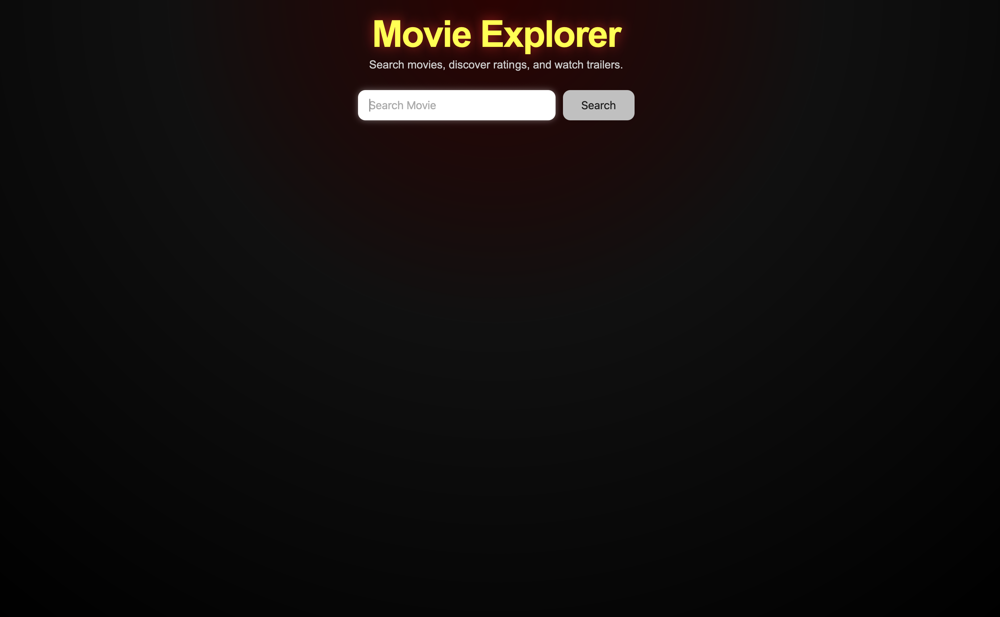
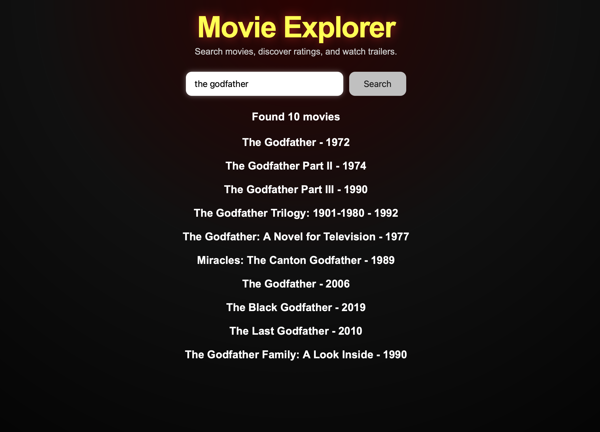
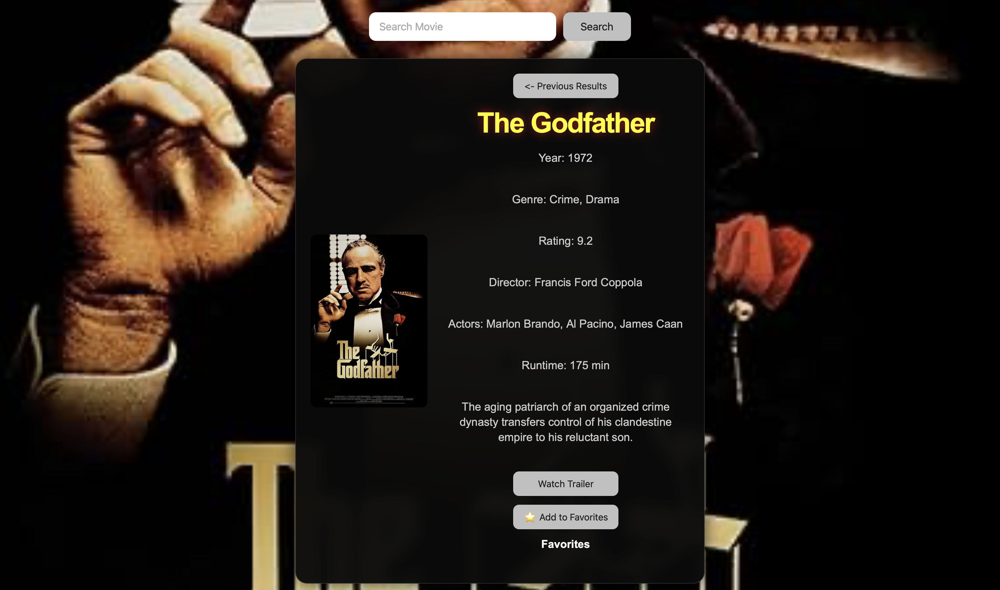

# Movie Explorer

A modern Movie EXplorer built with HTML,CSS and JavaScript using the OMDB API.

## Features
- Search movie by title
- Display up to 10 search results
- View detailed movie information
- Movie poster display
- IMDB rating
- Genre,director,actors and runtime
- Movie plot
- Watch official trailer on youtube
- Previous results button
- Enter key support
- Error handling for invalid searches

## Technologies
- HTML5
- CSS3
- JavaScript (ES6)
- OMDb API

##Live Demo
Click here to try:
https://calmstudiodev.github.io/movie-explorer/?v=3

## Screenshots

### Home Screen

### Search Results

### Movie Details - The Godfather

### Movie Details - The Dark Knight

